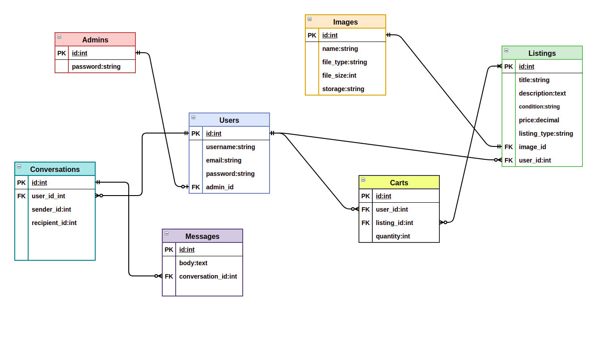

# NathanBlaga_T2A2

## **Marketplace Project - Workout Jungle**

### **Website URL: https://workout-jungle.herokuapp.com**

### **GitHub Repository: https://github.com/NJBLAGA/workout_jungle**

### **Installation:**

***NOTE:*** Workout Jungle was developed and tested on a ```linux system (ubuntu)```, no testing was undertaken on ```Mac``` or ```Windows``` OS.

#### **Getting started**

Follow the above link to Workout Jungle's GitHub Repo.

Once there, clone it down to your local machine.

Once installed, open the project in any text editor and navigate to the Gemfile.

By default the project will be running ```ruby version 2.7.2``` and ```rails version 6.0.3.5```, as shown below:


It is recommended that this project is run with rails version 6 +.

However if you wish to run the project with a different ruby or rails version, simply, change the version number in this file, save and close. Likewise if you wish to add any new gems to the project, add them in this file.

Once done, navigate to your terminal and run the following lines:

```r
# Installs node modules used through webpack for bootstrap js such as tooltips and navbar functionality.
yarn add bootstrap jquery popper.js
# Makes sure all dependencies in Gemfile are available for Workout Jungle
bundle install
#Install packages and project dependencies
yarn install --check-files
```

***NOTE:*** JS config files for bootstrap should already be set up out of the box, however if anything is missing or not working correctly, follow the below guide for setting up bootstrap JS for rails 6:

**https://gorails.com/episodes/how-to-use-bootstrap-with-webpack-and-rails**

#### **Setting up the Database**

Once the previous steps have been completed, it is time to set up your database. Navigate to your terminal and run the following line:

```r
# Creates a database for project
rails db:create
```

Once the database has been created, run the following line:

```r
# Runs migrations for the current environment that have not run yet.
rails db:migrate
```

An optional step is to populate the database with pre made admins, users and listings, using the ```seeds.rb``` file, to do so just run the following command:

```r
# Seeds your database with pre made admins, users and listings.
rails db:seed
```

Once successfully completed, Workout Jungle's database should be established and seeded, ready to run.

#### **Active Storage/Cloudinary**

***NOTE:*** If you wish to run another service such as AWS rather than Cloudinary, feel free to do so, however out of the box Workout Jungle is already setup to utilise Cloudinary and active storage.  

To set up this feature, open the project in a text editor, once open, navigate to the ```config``` folder and delete the file named ```credentials.yml.enc```

Now you can create your own by typing the following command in your terminal:

```r
EDITOR="code --wait" rails credentials:edit
```

This will open up a new credentials file, input the following:

```r
cloudinary: 
  service: Cloudinary
  cloud_name: xxxxxxxxxxx
  api_key: xxxxxxxxxxxxxxxxx
  api_secret: xxxxxxxxxxxxxxxxxx
```

***NOTE:*** You can find your ```cloud_name```, ```api_key``` and ```api_secret``` on your cloudinary dashboard. If you do not have an account, create one here:

**http://www.cloudinary.com**

Once your have signed up (It is for free) you will be directed to your dashboard.

Once you have entered your credentials in the same way shown above, save and close the file, the following will be displayed:

```r
File encrypted and saved.
```

Now navigate to the file named ```storage.yml``` in the ```config``` folder and confirm the following lines of code are present:

```r
cloudinary:
  service: Cloudinary
  cloud_name: <%= Rails.application.credentials.dig(:cloudinary, :cloud_name) %>
  api_key: <%= Rails.application.credentials.dig(:cloudinary, :api_key) %>
  api_secret: <%= Rails.application.credentials.dig(:cloudinary, :api_secret) %>
```

Last step is to navigate to the ```environments``` folder within the ```config``` folder of your project, there you will see two files named; ```development.rb``` and ```production.rb```.

Out of the box, both are configured to store uploaded files on cloudinary rather than locally. ***(No action is needed unless you wish to have files stored locally.)***

All configuration needed to run Workout Jungle alongside Cloudinary should now be completed and ready to run.

In your terminal line, type the following:

```r
#Runs rails server on port 3000(default)
rails s
```

Open a new browser, and type the following: ```localhost:3000```.

If successful you should see the following:


Log in(seeded usernames and passwords can be found in the ```seeds.rb``` file within the ```db``` folder of the project) or sign up with a new account.

Enjoy!

### **Tech Stack:**

#### **Application:**

- Ruby v- 2.7.2
- Rails v- 6.0.3.5

#### **Sever:**

- Puma

#### **Gems:**

- Devise
- Simple_form
- Jquery-rails
- Cloudinary
- Activestorage-cloudinary-service
- kramdown

#### **CSS Framework:**

- Bootstrap

#### **Database:**

- PostgreSQL

#### **Cloud Storage:**

- Cloudinary

#### **Deployment:**

- Heroku

#### **DevOps:**

- GitHub
- Trello


### **Background/Problem:**

The global pandemic of Covid-19 spread around the world in 2020 and continues to do so to this day. The virus has had dramatic and destructive influence over the world economy, resulting in various industries undergoing drastic change. One such industry was that of home fitness equipment. With multiple lockdowns occurring worldwide, commercial gyms were shutdown resulting in millions of people working out daily in their homes, backyards and various small local parks.  "ANZ Research economist Adelaide Timbrell told The New Daily sales of home gym equipment spiked after commercial gyms were closed by government" (Plastow 2020). "The initial surge petered out before the end of March, but Ms Timbrell said the decline in sales was caused more by a lack of supply than a lack of demand..Home exercise equipment is a niche market – most people generally join gyms instead, so supply chain issues were exacerbated by COVID-19 a lot more than other more mainstream products,” she said" (Reid 2020). Many experts believe that with a possible end to covid in the next few years, the industry still might see an influx of demand for home gym equipment over returning to commercial gy(Lufkin 2020).

### **Purpose:**

The original conception of Workout Jungle was to provide a marketplace in which Australian consumers could buy and sell new and used fitness equipment. While there are already various competing sites such as; graysfitness.com.au and gymsolutions.com.au, covid-19 created a ongoing demand for Australian consumers to continue exercising at home. Whether the demand is due to social media fads,  maintaining a healthy lifestyle (physically or mentally) Covid-19 has forced consumers to invest more into their home gyms. Workout Jungle has a primary goal on bringing buyers and sellers together in a safe, protected and user-friendly space. As of lunch it's various features allow the site to achieve these goals, with planned feature updates scheduled to roll out over the next year to not only improve our user experience but ultimately become the top Australian fitness gym marketplace.

### **Target Audience:**

The sites primary goal is to provide a marketplace for buyers and sellers throughout the Covid-19 pandemic. These buyers and sellers range from everyday Australian consumers, athletes and even commercial gyms. However the focus is to think beyond Covid-19 and expand to various focus groups such as;

- Stay at home parents
- Consumers living in remote areas of the country
- Consumers living in low income areas
- Professional and amateur bodybuilders/powerlifters
- Personal trainers
- Small gyms and fitness centers

### **User Stories & Proposed Solutions:**

- As a user I want assurance of my accounts privacy and safety.

**Solution:** Utilising the Devise gem, Workout Jungle will have a authentication structure for all its users and admins. I will also allow the site to restrict users on certain areas and features.

- As a user I want to be able to buy or sell fitness equipment.

**Solution:** Through Ruby on Rail using a MVC framework, the site will draw upon CRUD functionality to allow users to Create, Read, Update and Delete listings of different fitness equipment.

- As a seller I want to be able to upload an image and relevant information about my listings.

**Solution:** Through CRUD actions mentioned above, the user will be able to post and edit their listings. Additionally by utilising an relational database through PostgreSQL can the site store saved data and images pertaining to different listings. Finally in conjunction with a cloud based storage service such as Cloudinary, Workout Jungle can store the relevant images without worrying about local server space.

- A a seller I only want signed-in users of the site to be able to view my listings and message me.

**Solution:** Through Devise tools such as ```authenticate_user!``` and restrictions throughout the source code, only signed in users may access Workout Jungle.

- As a user I want to be able to contact sellers to discuss settlement and payment of listings.

**Solution:** Developing and integrating a message system in which users can freely message one another to negotiate prices, delivery details and payment.

- As a user I want to be able to store my favourite listings under one space.

**Solution:** Developing and integrating a cart or wish list feature that allows users to add listings to a "bucket". Users can then access that bucket with ease to either purchases or remove the listing.

- As an admin I want to be able to uphold Workout Jungle's integrity towards its users by having the scope to not only view all listings but delete them if they are found to be in violation of the terms and conditions.

**Solution:** While on the all listings page, a "delete" feature will be present for only admin, allowing them to remove any listings found to be of bad taste or false nature.

- As an admin I want the ability to delete users if they are found guilty of violating the terms and conditions.

**Solution:** Create a admin dashboard in which admin can view all current users. This page will only be accessible to admin, and will provide a feature in which they may delete users if said user is found violating the terms and conditions.

- As and admin I want the ability to assign the role of admin to users who wish to help grow the community and sites scalability.

**Solution:** Create a admin dashboard in which admin can view all current users. This page will only be accessible to admin, and will provide a feature in which they make assign the role of admin to said user.

- As a user I want a user-friendly interface that can function on desktop, tablet and mobile devices with a simplistic desgin and responsive navigational layout.

**Solution:** Use Bootstrap framework to build a responsive and simplistic desgin, including a full functional nav-bar that transcends to all devices.

### **Trello**

**Workout Jungle Trello board: https://trello.com/b/KgPASnGD/workout-jungle**


### **Sitemap:**


### **Wireframes:**


### **Functionality/features:**


#### **Listings System:**


#### **User System:**


#### **Admin System:**


#### **Responsive Navbar:**


#### **Filter System:**


#### **Message System:**


#### **Wish List:**


### **ERD:**



### **High-level components:**

- rails heroku, heroku, any software

### **Model Relationships**
active record understand and explain

ENQUIRE

### **Database Relations:**

ENQUIRE

### **Database schema design**

ENQUIRE

## **Slide Deck**

- An outline of the problem you were trying to solve by building this particular marketplace app, adn why it's a problem that needs solving.
- A walk through of your app.


## **References:**

Plastow, K 5 May 2020, Sports retailers on track for personal best following spike in demand, thenewdaily.com.au, finance, consumer, viewed 1 March 2021, https://thenewdaily.com.au/finance/consumer/2020/05/05/sports-sales-anz-coronavirus/

Reid, E 24 March 2020, Home GY Equipment New Target of Covid-19, channelnews.com.au, viewed 1 March 2021, https://www.channelnews.com.au/home-gym-equipment-new-target-of-covid-19-panic-buying/

Lufkin, B 5 May 2020, The evolution of home fitness, bbc.com, worklife, article, viewed 1 March 2021, https://www.bbc.com/worklife/article/20200504-covid-19-update-quarantine-home-workouts-during-coronavirus


