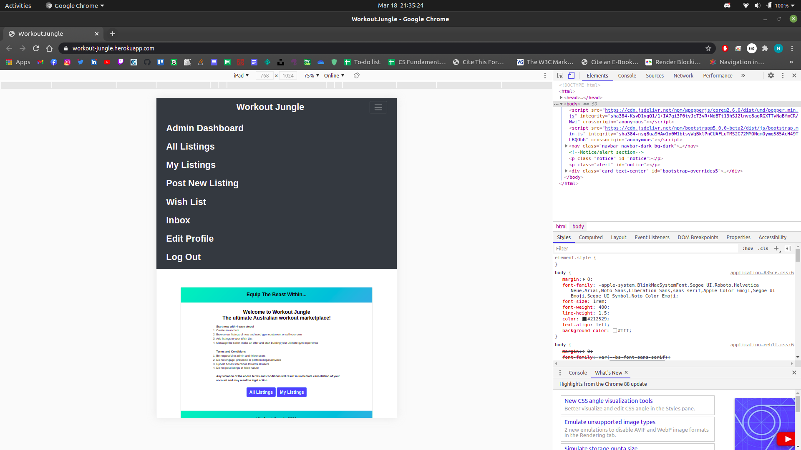
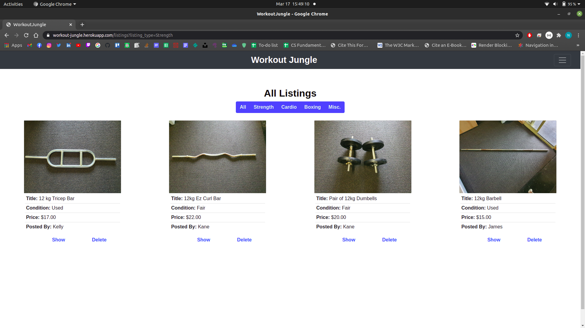

# NathanBlaga_T2A2

## **Marketplace Project - Workout Jungle**

### **Website URL: https://workout-jungle.herokuapp.com**

### **GitHub Repository: https://github.com/NJBLAGA/workout_jungle**

### **Installation:**

***NOTE:*** Workout Jungle was developed and tested on a ```linux system (ubuntu)```, no testing was undertaken on ```Mac``` or ```Windows``` OS.

#### **Getting started**

Follow the above link to Workout Jungle's GitHub Repo.

Once there, clone it down to your local machine.

Once installed, open the project in any text editor and navigate to the Gemfile.

By default the project will be running ```ruby version 2.7.2``` and ```rails version 6.0.3.5```, as shown below:


It is recommended that this project is run with rails version 6 +.

However if you wish to run the project with a different ruby or rails version, simply, change the version number in this file, save and close. Likewise if you wish to add any new gems to the project, add them in this file.

Once done, navigate to your terminal and run the following lines:

```r
# Installs node modules used through webpack for bootstrap js such as tooltips and navbar functionality.
yarn add bootstrap jquery popper.js
# Makes sure all dependencies in Gemfile are available for Workout Jungle
bundle install
#Install packages and project dependencies
yarn install --check-files
```

***NOTE:*** JS config files for bootstrap should already be set up out of the box, however if anything is missing or not working correctly, follow the below guide for setting up bootstrap JS for rails 6:

**https://gorails.com/episodes/how-to-use-bootstrap-with-webpack-and-rails**

#### **Setting up the Database**

Once the previous steps have been completed, it is time to set up your database. Navigate to your terminal and run the following line:

```r
# Creates a database for project
rails db:create
```

Once the database has been created, run the following line:

```r
# Runs migrations for the current environment that have not run yet.
rails db:migrate
```

An optional step is to populate the database with pre made admins, users and listings, using the ```seeds.rb``` file, to do so just run the following command:

```r
# Seeds your database with pre made admins, users and listings.
rails db:seed
```

Once successfully completed, Workout Jungle's database should be established and seeded, ready to run.

#### **Active Storage/Cloudinary**

***NOTE:*** If you wish to run another service such as AWS rather than Cloudinary, feel free to do so, however out of the box Workout Jungle is already setup to utilise Cloudinary and active storage.  

To set up this feature, open the project in a text editor, once open, navigate to the ```config``` folder and delete the file named ```credentials.yml.enc```

Now you can create your own by typing the following command in your terminal:

```r
EDITOR="code --wait" rails credentials:edit
```

This will open up a new credentials file, input the following:

```r
cloudinary: 
  service: Cloudinary
  cloud_name: xxxxxxxxxxx
  api_key: xxxxxxxxxxxxxxxxx
  api_secret: xxxxxxxxxxxxxxxxxx
```

***NOTE:*** You can find your ```cloud_name```, ```api_key``` and ```api_secret``` on your cloudinary dashboard. If you do not have an account, create one here:

**http://www.cloudinary.com**

Once your have signed up (It is for free) you will be directed to your dashboard.

Once you have entered your credentials in the same way shown above, save and close the file, the following will be displayed:

```r
File encrypted and saved.
```

Now navigate to the file named ```storage.yml``` in the ```config``` folder and confirm the following lines of code are present:

```r
cloudinary:
  service: Cloudinary
  cloud_name: <%= Rails.application.credentials.dig(:cloudinary, :cloud_name) %>
  api_key: <%= Rails.application.credentials.dig(:cloudinary, :api_key) %>
  api_secret: <%= Rails.application.credentials.dig(:cloudinary, :api_secret) %>
```

Last step is to navigate to the ```environments``` folder within the ```config``` folder of your project, there you will see two files named; ```development.rb``` and ```production.rb```.

Out of the box, both are configured to store uploaded files on cloudinary rather than locally. ***(No action is needed unless you wish to have files stored locally.)***

All configuration needed to run Workout Jungle alongside Cloudinary should now be completed and ready to run.

In your terminal line, type the following:

```r
#Runs rails server on port 3000(default)
rails s
```

Open a new browser, and type the following: ```localhost:3000```.

If successful you should see the following:


Log in(seeded usernames and passwords can be found in the ```seeds.rb``` file within the ```db``` folder of the project) or sign up with a new account.

Enjoy!

### **Tech Stack:**

#### **Application:**

- Ruby v- 2.7.2
- Rails v- 6.0.3.5

#### **Sever:**

- Puma

#### **Gems:**

- Devise
- Simple_form
- Jquery-rails
- Cloudinary
- Activestorage-cloudinary-service
- kramdown

#### **CSS Framework:**

- Bootstrap

#### **Database:**

- PostgreSQL

#### **Cloud Storage:**

- Cloudinary

#### **Deployment:**

- Heroku

#### **DevOps:**

- GitHub
- Trello

### **Background/Problem:**

The global pandemic of Covid-19 spread around the world in 2020 and continues to do so to this day. The virus has had dramatic and destructive influence over the world economy, resulting in various industries undergoing drastic change. One such industry was that of home fitness equipment. With multiple lockdowns occurring worldwide, commercial gyms were shutdown resulting in millions of people working out daily in their homes, backyards and various small local parks.  "ANZ Research economist Adelaide Timbrell told The New Daily sales of home gym equipment spiked after commercial gyms were closed by government" (Plastow 2020). "The initial surge petered out before the end of March, but Ms Timbrell said the decline in sales was caused more by a lack of supply than a lack of demand..Home exercise equipment is a niche market – most people generally join gyms instead, so supply chain issues were exacerbated by COVID-19 a lot more than other more mainstream products,” she said" (Reid 2020). Many experts believe that with a possible end to covid in the next few years, the industry still might see an influx of demand for home gym equipment over returning to commercial gy(Lufkin 2020).

### **Importance:**

Studies have shown that exercise is a vital key in combating stress, dealing with depression and anxiety disorders. Due to the nature of the lockdowns, a number of people who suffered from anxiety and depression from being alone had a difficult time dealing with the present situation. Australians did not have access to a personal home gym or fitness equipment. This meant for months, some Australians went without any form of exercise resulting in no real form of releasing tension and decreasing growing levels of stress and anxiety. Beyond the Covid-19 era, people steaming from low level households could not support a gym membership or invest into a state of the art home gym. This is why it is important that online marketplaces such as Workout Jungle exists and continue to help paring buyers and sellers of new and used fitness equipment, through the Covid-19 pandemic and beyond 2021 as well.

### **Purpose:**

The original conception of Workout Jungle was to provide a marketplace in which Australian consumers could buy and sell new and used fitness equipment. While there are already various competing sites such as; graysfitness.com.au and gymsolutions.com.au, covid-19 created a ongoing demand for Australian consumers to continue exercising at home. Whether the demand is due to social media fads,  maintaining a healthy lifestyle (physically or mentally) Covid-19 has forced consumers to invest more into their home gyms. Workout Jungle has a primary goal on bringing buyers and sellers together in a safe, protected and user-friendly space. As of lunch it's various features allow the site to achieve these goals, with planned feature updates scheduled to roll out over the next year to not only improve our user experience but ultimately become the top Australian fitness gym marketplace.

### **Target Audience:**

The sites primary goal is to provide a marketplace for buyers and sellers throughout the Covid-19 pandemic. These buyers and sellers range from everyday Australian consumers, athletes and even commercial gyms. However the focus is to think beyond Covid-19 and expand to various focus groups such as;

- Stay at home parents
- Consumers living in remote areas of the country
- Consumers living in low income areas
- Professional and amateur bodybuilders/powerlifters
- Personal trainers
- Small gyms and fitness centers

### **User Stories & Proposed Solutions:**

- As a user I want assurance of my accounts privacy and safety.

**Solution:** Utilising the Devise gem, Workout Jungle will have a authentication structure for all its users and admins. I will also allow the site to restrict users on certain areas and features.

- As a user I want to be able to buy or sell fitness equipment.

**Solution:** Through Ruby on Rail using a MVC framework, the site will draw upon CRUD functionality to allow users to Create, Read, Update and Delete listings of different fitness equipment.

- As a seller I want to be able to upload an image and relevant information about my listings.

**Solution:** Through CRUD actions mentioned above, the user will be able to post and edit their listings. Additionally by utilising an relational database through PostgreSQL can the site store saved data and images pertaining to different listings. Finally in conjunction with a cloud based storage service such as Cloudinary, Workout Jungle can store the relevant images without worrying about local server space.

- A a seller I only want signed-in users of the site to be able to view my listings and message me.

**Solution:** Through Devise tools such as ```authenticate_user!``` and restrictions throughout the source code, only signed in users may access Workout Jungle.

- As a user I want to be able to contact sellers to discuss settlement and payment of listings.

**Solution:** Developing and integrating a message system in which users can freely message one another to negotiate prices, delivery details and payment.

- As a user I want to be able to store my favourite listings under one space.

**Solution:** Developing and integrating a cart or wish list feature that allows users to add listings to a "bucket". Users can then access that bucket with ease to either purchases or remove the listing.

- As an admin I want to be able to uphold Workout Jungle's integrity towards its users by having the scope to not only view all listings but delete them if they are found to be in violation of the terms and conditions.

**Solution:** While on the all listings page, a "delete" feature will be present for only admin, allowing them to remove any listings found to be of bad taste or false nature.

- As an admin I want the ability to delete users if they are found guilty of violating the terms and conditions.

**Solution:** Create a admin dashboard in which admin can view all current users. This page will only be accessible to admin, and will provide a feature in which they may delete users if said user is found violating the terms and conditions.

- As and admin I want the ability to assign the role of admin to users who wish to help grow the community and sites scalability.

**Solution:** Create a admin dashboard in which admin can view all current users.S This page will only be accessible to admin, and will provide a feature in which they make assign the role of admin to said user.

- As a user I want a user-friendly interface that can function on desktop, tablet and mobile devices with a simplistic desgin and responsive navigational layout.

**Solution:** Use Bootstrap framework to build a responsive and simplistic desgin, including a full functional nav-bar that transcends to all devices.

### **Trello**

The tasks and features comprised of Workout Jungle's development were allocated and tracked through the below trello board. Following an agile methodology each feature of the application was developed over multiple sprints. Each sprint/feature was allocated a time frame for development, testing, integration and deployment.

**Workout Jungle Trello board: https://trello.com/b/KgPASnGD/workout-jungle**


The Tasks Completed column houses tasks that focus on research and planning. A majority of these tasks were completed before any code was written. Below a brief description of the key tasks:

- **Research fitness equipment sites:** It was important to understand the landscape of the market a where it was positioned in regards to pre and post Covid-19. Research into other applications was needed to better understand what consumers expect and need for such application.
- **Desgin sitemap:** The sitemap was designed with the user stories in mind, a simplistic and user-friendly site with a strong navigational layout.
- **Desgin wireframes:** The wireframes were designed with the user stories in mind as well. It was always the intention on using Bootstrap as the styling framework for this project. Other frameworks such as Bulma and tailwind were considered and even tested, however did not make it to the final product.
- **Design ERD:** The ERD was needed to have a better understanding of how the database and its relations would interact within the application and so more time was allocated to this task.

The remaining features columns were used to house the development, testing, integration and deployment of the key features of Workout Jungle, Below a brief description of the key features:

- **User Model:** Setting up user authentication and profile management through devise was key in establishing the framework for the following models. Significant time was allocated to this feature.
- **Admin Model:** Created through devise, this model acts as an extension of the user model and is the foundation for the entire admin role for the app. Significant time was also allocated to this feature.
- **Listings Model:** The listing model is seen as the key feature of the entire app and so it was spilt into several sprints for wide variety of functionality throughout the site. Sprints were created for;
  - All listings page
  - Your listings page (changed to My listings page)
  - Post new listing page
  - Show listing page
- **Active Storage & Cloudinary:** The main focus of this sprint was to have images attached to listings being stored on a cloud sever(Cloudinary) rather than being stored locally. It was vital to the development of Workout Jungle to provide efficient and effective storage capabilities. Significant time was also allocated to this feature.
- **Shopping Cart:** It was important to meet user stories and so a shopping cart was developed for the application, allowing users to save their favourite listings until a settlement could be arranged with the seller. It should be noted, that through development, due to no really payment option being available, the name of the feature was changed on the front end of the code to "Wish List". A major portion of time (2.5 days) was also allocated to this feature.
- **Message System:** Due to the nature of the application(heavily borrowed from gumtree), it was important to develop a messaging system in which buyers and sellers could exchange information, settlement on price, negotiating arrangements, delivery and payment options etc. A major portion of time (3 days) was also allocated to this feature.
- **Admin Dashboard:** Building upon the admin model, Workout Jungle needed an admin only accessible page in which users could be deleted or assigned the role of admin. Considerable time was given to making sure this page was functioning correctly and was completely unreachable by average users.
- **Nav-bar/styling:** The nav-bar and overall styling was implemented towards the end of the applications development cycle, the sprint was focused on building a nav-bar through bootstrap that satisfied the user stories. While the layout and desgin of the site was focused on having a simplistic and yet functionally layout on mobile, desktop and tablet devices.

### **Sitemap**


The initial sitemap developed and desgined for Workout Jungle held its basic structure all throughout development. As shown above when a customer lands on the home page (Jungle), they must log in or sing up to have access to the site. Throughout development, the chock point for the user needing to be signed in varied. However after extensive testing, it was decided to place the sign in feature on the home page and lock the rest of the site out to any non signed in users. This was due to fulfilling the requirements of the users stories and more importantly to support the structure of the application. Overall it provided a more user-friendly and smooth experience while upholding users privacy and safety. An additionally layer was added where if a user is signed in and has the role of an admin, then when would have access to an optional link; the admin dashboard. This insured that an average user could not access this admin dashboard and abuse the features of deleting or assigning admin roles.

### **Wireframes:**

The initial wireframes designed and developed for Workout Jungle maintained their basic structure and layout throughout the development and production cycles. However a few key elements were either removed, modified or completely revamped for the final product. Below is a breakdown of all wireframes and any changes that occurred. It should be noted that from these initial designs to the final product, Workout Jungle maintained a Mobile first design and will look to the future to continuously improve its design.

**Home Page:** The home page had little to no changes throughout development, all three designs maintained their structure and layout features leading to the final product.


**Nav-bar:** The nav-bar had several changes, although the wireframes showed a burger element in all three views, throughout the styling sprint, several changes were made to a more 'traditional' style. However it was finally settle upon to have a mobile styled navbar for all three views. The links changed as well, as Your Listings became My Listings, Cart became Wish List, Messages became Inbox and Admin changed to Admin Dashboard.


**Sign Up Page:** There was little no change to the sign up form page throughout development. It maintained a basic and simple sign up style and structure.


**Sign In Page:** Likewise the Sign In Page did not change at all and kept its structure.


**Edit Profile Page:** The Edit Profile/Change Password saw some changes throughout its sprint, mostly wording and desgin elements but nothing to drastic. It is a key page that will be revisited in the future for minor changes. Plans are to allow the user more customisation of their profile, an avatar, bio and a toggle message on/off feature.


**Post New Listings:** Other than a name change, this page only saw a desgin change slightly and nothing to drastic.


**All Listings Page:** This page saw major changes throughout its sprint, first of all, it has two views, one for a user and one for an admin. As a user on this page, they can only see and click on the show button while an admin has the power and can access the delete button function on this page. The basic structure of the cards that house the listings saw changes throughout the styling sprint and were close to the initial desgin with only small changes to their functionality.


**My Listings Page:** My Listings Page saw minor changes to its structure and overall desgin. There was a stage during the sprint that the filter bar was removed from the page, yet brought back to allow the user to have more sorting functionality on the page.


**Show Listings Page:** As shown on the wireframes, the user would have multiple images attached and displayed on this page, however this was later changed to one image instead. Future plans include allowing users to upload and view multiple images for each listing.


**Wish List Page:** Originally Shopping cart or Cart, the change to Wish List better suited the style and flow of the site as a whole. A user can add their favourite listings to a list in which they could access very easily until a settlement can be reached with the seller. The desgin went through several changes until it reached the final products desgin(which aligns closely to that of the wireframes).


**Inbox Page:** Inbox design went through several iterations before settling on the final desgin, it fits closely to the original desgin and act as an user-friendly interface for users to engage in conversations with other users.


**Message Page:** The message page saw some changes but was reverted back to the original desgin due to time constraints. Future updates will be implemented to refine its interface including the use of a notification system as well.


**Admin Dashboard Page:** The Admin Dashboard saw changes in its button layout throughout the different devices, however kept true to its original desgin and layout. Future updates of this page will include a private messaging system between admins, the introduction of a moderator role and more security checks.


### **Functionality/features:**


#### **Listings System:**


#### **User System:**


#### **Admin System:**


#### **Responsive Navbar:**



#### **Filter System:**



#### **Message System:**


#### **Wish List:**


### **ERD:**


### **High-level components:**

- rails heroku, heroku, any software

### **Model Relationships**
active record understand and explain

ENQUIRE

### **Database Relations:**

ENQUIRE

### **Database schema design**

ENQUIRE

## **Slide Deck**

- An outline of the problem you were trying to solve by building this particular marketplace app, adn why it's a problem that needs solving.
- A walk through of your app.


## **References:**

Plastow, K 5 May 2020, Sports retailers on track for personal best following spike in demand, thenewdaily.com.au, finance, consumer, viewed 1 March 2021, https://thenewdaily.com.au/finance/consumer/2020/05/05/sports-sales-anz-coronavirus/

Reid, E 24 March 2020, Home GY Equipment New Target of Covid-19, channelnews.com.au, viewed 1 March 2021, https://www.channelnews.com.au/home-gym-equipment-new-target-of-covid-19-panic-buying/

Lufkin, B 5 May 2020, The evolution of home fitness, bbc.com, worklife, article, viewed 1 March 2021, https://www.bbc.com/worklife/article/20200504-covid-19-update-quarantine-home-workouts-during-coronavirus


